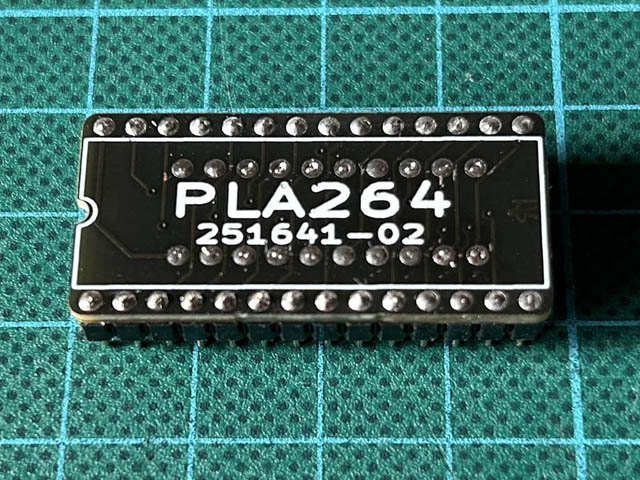

# PLA264

The PLA264 is a replacement for the MOS 251641-02 PLA chip used in Commodore's TED-based 8-bit computers, the C16, C116, and Plus/4. It is an alternative layout to the [PLA16V8](https://www.freepascal.org/~daniel/c16pla/). Like the original, it is based on the GAL16V8 and it requires the same JED file for programming. Unlike the original, when properly assembled, it is small enough to actually fit into the case of a Commodore Plus/4 without issues.

There is no warranty whatsoever. **USE AT YOUR OWN RISK!**.

See my [blog post](https://www.hackup.net/2023/05/how-to-lower-your-pla-the-pla264/) for more details.

## License

This work is licensed under a
[Creative Commons Attribution-NonCommercial-ShareAlike 4.0 International License](http://creativecommons.org/licenses/by-nc-sa/4.0/).
